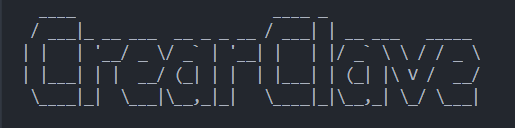

# 🔐 Generador de Contraseñas Seguras

Bienvenido a **Generador de Contraseñas Seguras** 🛡️, una herramienta simple pero poderosa para generar contraseñas aleatorias y seguras en segundos.

---

## 🚀 Características
✅ Genera contraseñas seguras de cualquier longitud.  
✅ Usa letras mayúsculas, minúsculas, números y caracteres especiales.  
✅ Valida la entrada y evita errores.  
✅ Mensajes de advertencia si la contraseña es demasiado corta.  
✅ Estilo visual atractivo con `pyfiglet`.  

---

## 🎯 Requisitos
📌 **Python 3.x**
📌 Instalar `pyfiglet` (si no lo tienes):
```bash
pip install pyfiglet
```

---

## 🛠️ Instalación y Uso
1️⃣ **Clona el repositorio:**
```bash
git clone https://github.com/tu-usuario/generador-claves.git
cd generador-claves
```
2️⃣ **Ejecuta el script:**
```bash
python generar_clave.py
```
3️⃣ **Ingresa la longitud de la contraseña** (mínimo 8 caracteres).  
4️⃣ **Obtén tu contraseña segura** ✅.  

---

## 📸 Ejemplo de Ejecución
```


 

 --- Generador de Contraseñas Seguras ---

Ingrese el tamaño de la contraseña (mínimo 8): 12
✅ La contraseña generada es: 4A&vX!9g@1Kd
```

---

## 🏆 Contribuciones
¡Las contribuciones son bienvenidas! Si tienes ideas para mejorar este generador, **haz un fork y envía un PR**. 🚀

---

## 📄 Licencia
Este proyecto está bajo la licencia **MIT**. Puedes usarlo libremente. 😉

